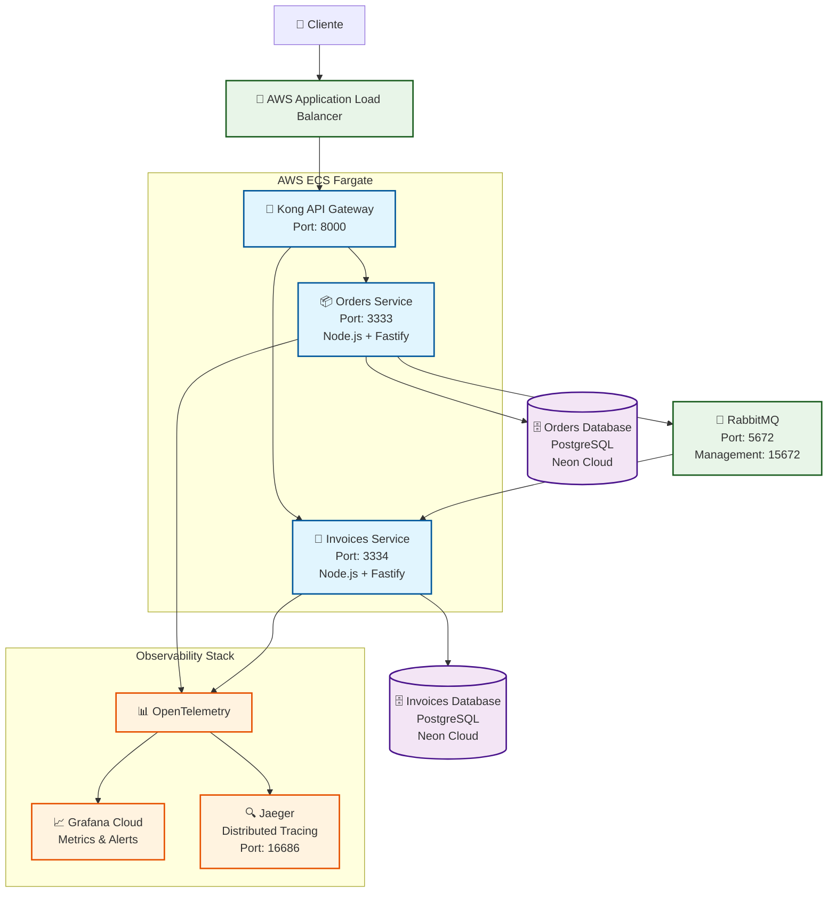
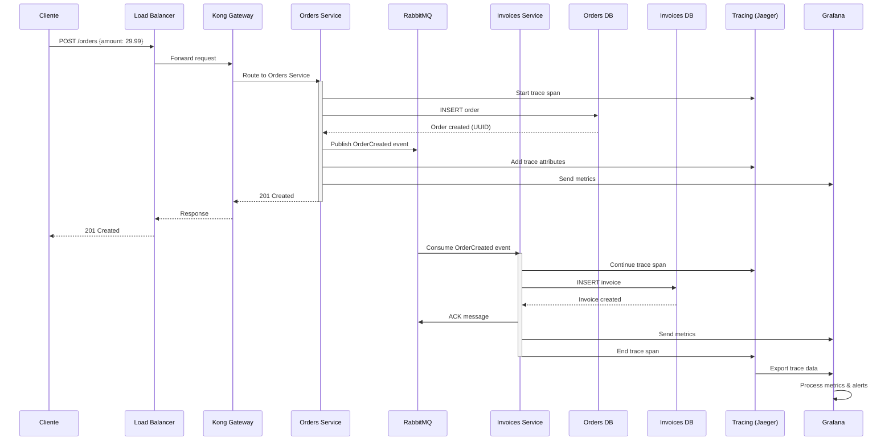
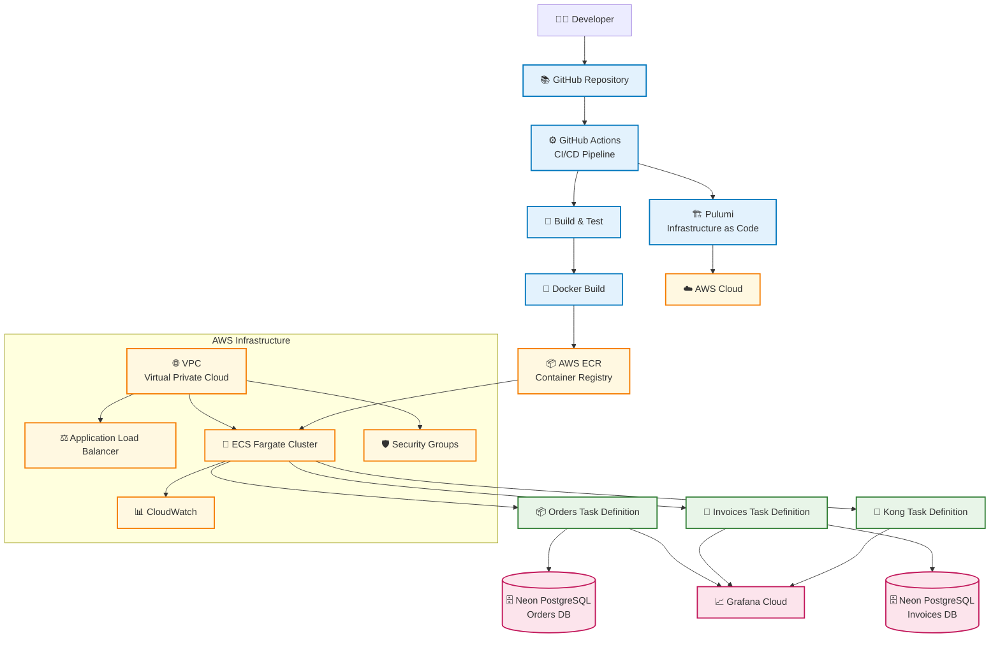
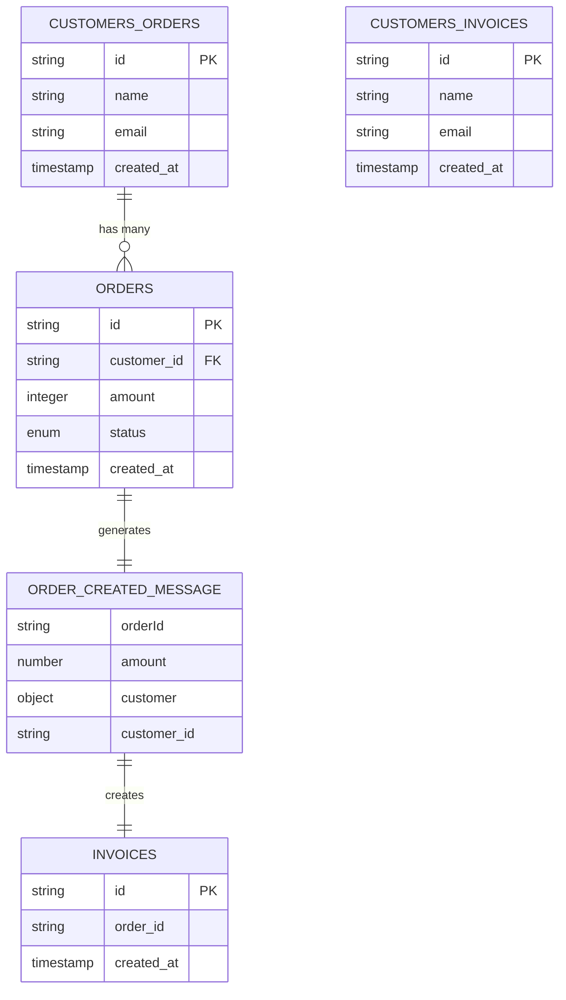
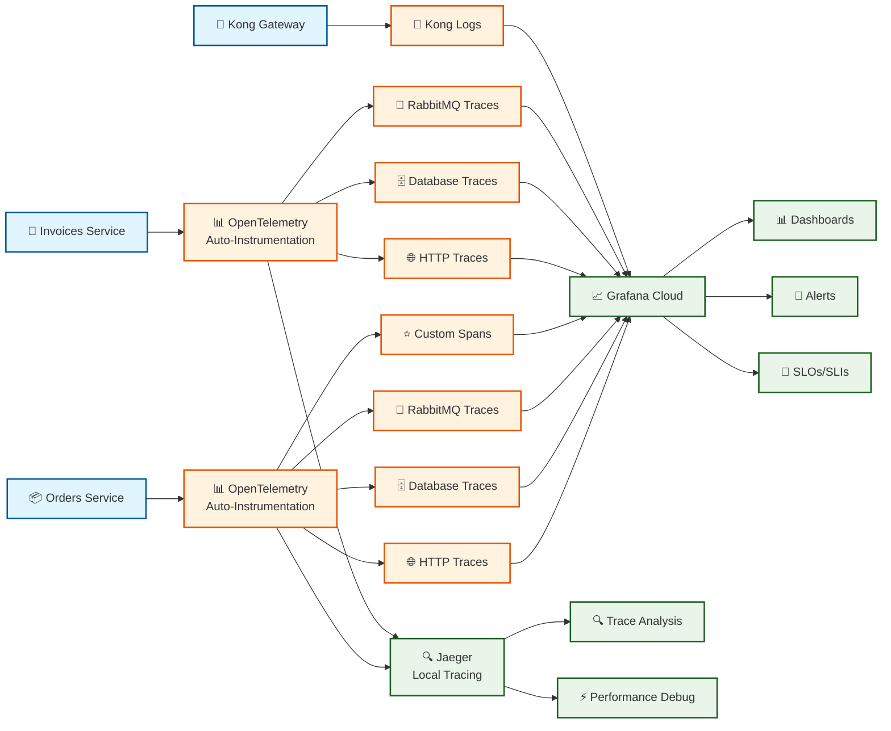
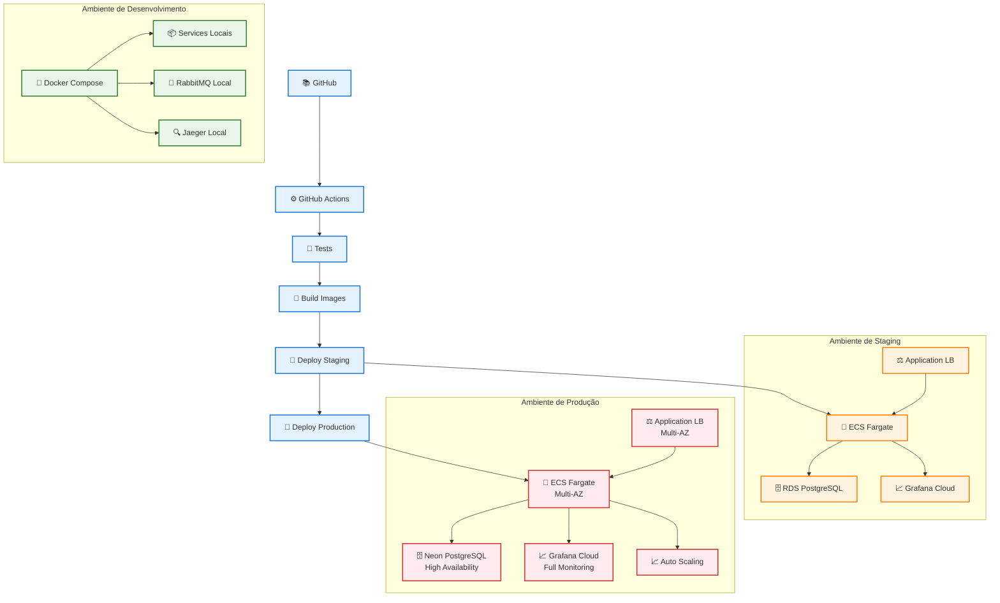

# Diagrama de Arquitetura - Microsserviços Node.js

## Visão Geral da Arquitetura

## Fluxo de Dados Detalhado

## Arquitetura de Deployment

## Estrutura de Dados e Contratos

## Fluxo de Observabilidade

## Padrões de Comunicação

```mermaid
graph TB
    %% Synchronous Communication
    subgraph "Comunicação Síncrona"
        Client_Sync[👤 Cliente] --> Kong_Sync[🚪 Kong Gateway]
        Kong_Sync --> Orders_Sync[📦 Orders Service]
        Kong_Sync --> Invoices_Sync[🧾 Invoices Service]
        
        Orders_Sync --> OrdersDB_Sync[(🗄️ Orders DB)]
        Invoices_Sync --> InvoicesDB_Sync[(🗄️ Invoices DB)]
    end
    
    %% Asynchronous Communication
    subgraph "Comunicação Assíncrona"
        Orders_Async[📦 Orders Service] --> RabbitMQ_Async[🐰 RabbitMQ<br/>Exchange: orders<br/>Queue: orders]
        RabbitMQ_Async --> Invoices_Async[🧾 Invoices Service]
        
        %% Message Flow
        Orders_Async -.->|Publish| OrderCreated[📨 OrderCreated Event]
        OrderCreated -.->|Route| RabbitMQ_Async
        RabbitMQ_Async -.->|Consume| Invoices_Async
        Invoices_Async -.->|ACK| RabbitMQ_Async
    end
    
    %% Health Checks
    subgraph "Health Monitoring"
        ALB_Health[⚖️ Load Balancer] -.->|Health Check| Orders_Health[📦 /health]
        ALB_Health -.->|Health Check| Invoices_Health[🧾 /health]
        ALB_Health -.->|Health Check| Kong_Health[🚪 /health]
    end
    
    %% Styling
    classDef sync fill:#e3f2fd,stroke:#1976d2,stroke-width:2px
    classDef async fill:#f3e5f5,stroke:#7b1fa2,stroke-width:2px
    classDef health fill:#e8f5e8,stroke:#388e3c,stroke-width:2px
    
    class Client_Sync,Kong_Sync,Orders_Sync,Invoices_Sync,OrdersDB_Sync,InvoicesDB_Sync sync
    class Orders_Async,RabbitMQ_Async,Invoices_Async,OrderCreated async
    class ALB_Health,Orders_Health,Invoices_Health,Kong_Health health
```

## Estratégia de Deployment

---

## Legenda dos Diagramas

### Símbolos Utilizados
- 👤 **Cliente**: Usuário final ou sistema externo
- 🚪 **API Gateway**: Ponto de entrada único (Kong)
- 📦 **Orders Service**: Microsserviço de pedidos
- 🧾 **Invoices Service**: Microsserviço de faturas
- 🐰 **RabbitMQ**: Message broker para comunicação assíncrona
- 🗄️ **Database**: Bancos de dados PostgreSQL
- 📊 **OpenTelemetry**: Framework de observabilidade
- 📈 **Grafana**: Plataforma de monitoramento
- 🔍 **Jaeger**: Sistema de distributed tracing
- ⚖️ **Load Balancer**: Balanceador de carga AWS
- 🚢 **ECS**: Amazon Elastic Container Service
- 🐳 **Docker**: Containerização
- ⚙️ **CI/CD**: Pipeline de integração e deployment

### Cores dos Componentes
- **Azul**: Serviços de aplicação
- **Roxo**: Bancos de dados
- **Verde**: Infraestrutura
- **Laranja**: Observabilidade
- **Vermelho**: Produção
- **Amarelo**: Staging

Estes diagramas capturam a arquitetura completa do projeto, desde o desenvolvimento local até o deployment em produção, incluindo todos os aspectos de observabilidade, comunicação entre serviços e estratégias de deployment.